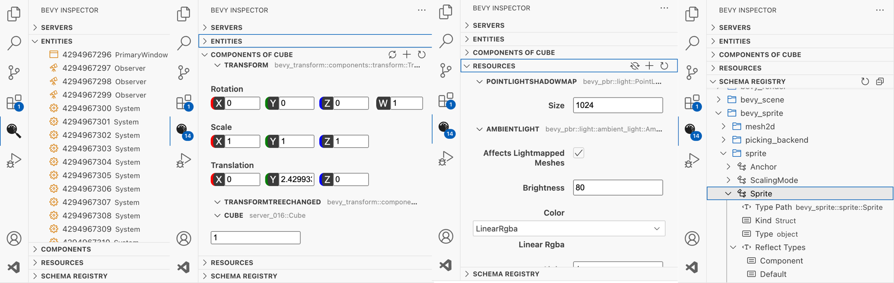
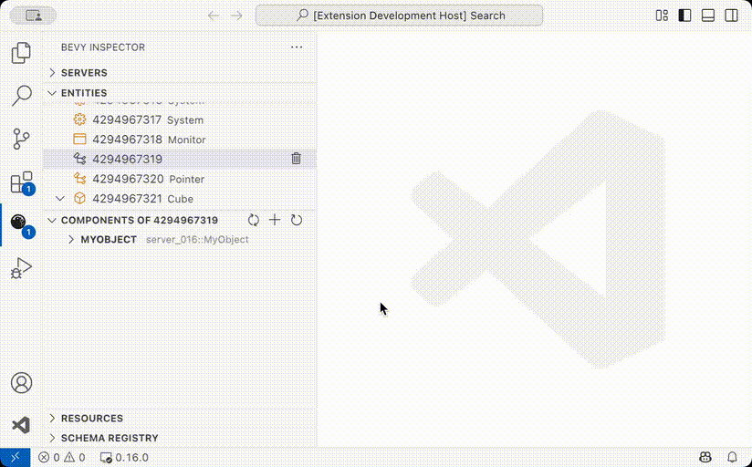
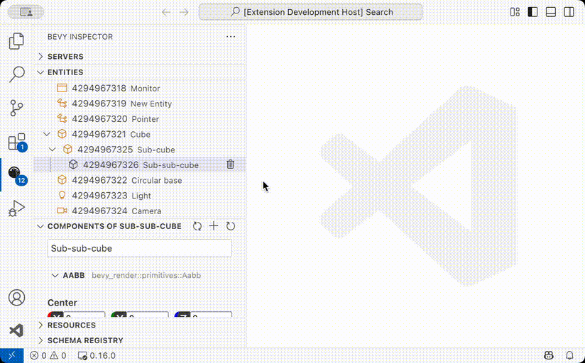
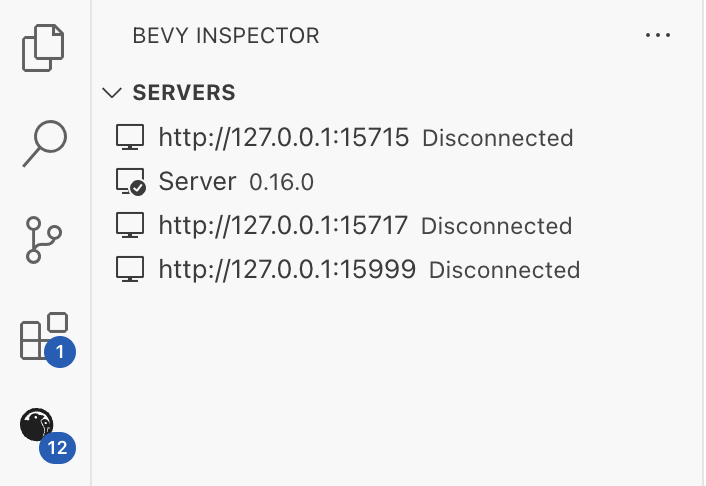
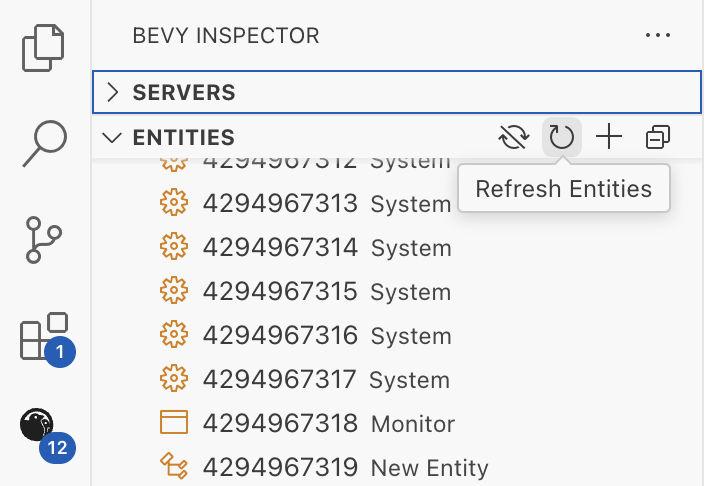

# Bevy Inspector Visual Studio Code Extension

Display live data from your [Bevy](https://bevyengine.org/) application using the [Bevy Remote Protocol HTTP plugin](https://docs.rs/bevy/0.16.0/bevy/remote/index.html).

## Features

- 🧩 Display Bevy entities, components, resources and schema registry right in your editor side view.



- ✏️ Insert or modify component and resource values (only on Bevy `0.16`+).



- 🏗️ Spawn, destroy or re-parent entities.



- 🔗 Manage multiple Bevy servers. Compatible with Bevy `0.15`, `0.16` and more.



- 🔃 Refresh data when wanted or via automatic polling with configurable delay.



## Usage

The extension can be installed from:

- The [VS Code Marketplace](https://marketplace.visualstudio.com/items?itemName=splo.vscode-bevy-inspector).
- The [Open VSX Registry](https://open-vsx.org/extension/splo/vscode-bevy-inspector).

There are example servers at [`examples/`](./examples) that show valid Bevy application configurations for different Bevy versions.

In short here are the requirements:

- A Rust project with the `bevy` dependency and the `bevy_remote` feature enabled. Bevy should be at least `0.15.x` but `0.16.x` is required for multiple features (display resources and registry, modify components and resources).

```toml
# Cargo.toml
[dependencies]
bevy = { version = "0.17.0", features = ["bevy_remote"] }
```

- A Bevy application with the `RemotePlugin` and `RemoteHttpPlugin` plugins enabled.

```rust
# src/main.rs
fn main() {
    App::new()
        .add_plugins(DefaultPlugins)
        .add_plugins(RemotePlugin::default())
        .add_plugins(RemoteHttpPlugin::default())
        .run();
}
```

By default the connection URL is `http://127.0.0.1:15702`.

## Development

Read the [contributing guide](https://github.com/splo/vscode-bevy-inspector/CONTRIBUTING.md):

- [Reporting Issues](./CONTRIBUTING.md#reporting-issues)
- [Pull Requests](./CONTRIBUTING.md#pull-requests)
- [Code Style](./CONTRIBUTING.md#code-style)
- [Development Tasks](./CONTRIBUTING.md#development-tasks)
  - [Setup](./CONTRIBUTING.md#setup)
  - [Building and Running](./CONTRIBUTING.md#building-and-running)
  - [Running Bevy Example Servers](./CONTRIBUTING.md#running-bevy-example-servers)
  - [Code Style, Linting, and Formatting](./CONTRIBUTING.md#code-style-linting-and-formatting)
  - [Storybook](./CONTRIBUTING.md#storybook)
- [Project Structure](./CONTRIBUTING.md#project-structure)
  - [Main VS Code Extension Entry Point](./CONTRIBUTING.md#main-vs-code-extension-entry-point)
  - [React-Based Webviews](./CONTRIBUTING.md#react-based-webviews)
  - [Shared Libraries](./CONTRIBUTING.md#shared-libraries)
- [Questions](./CONTRIBUTING.md#questions)
